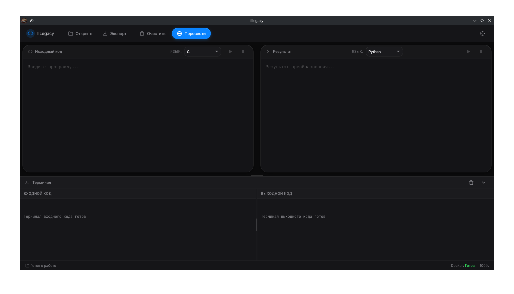
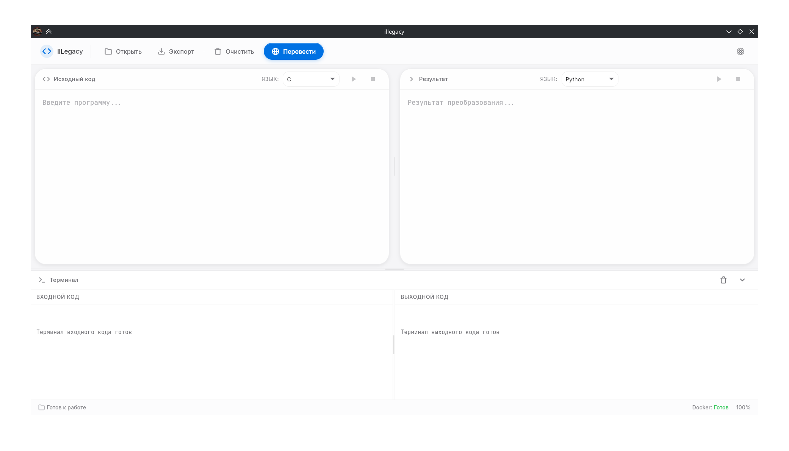
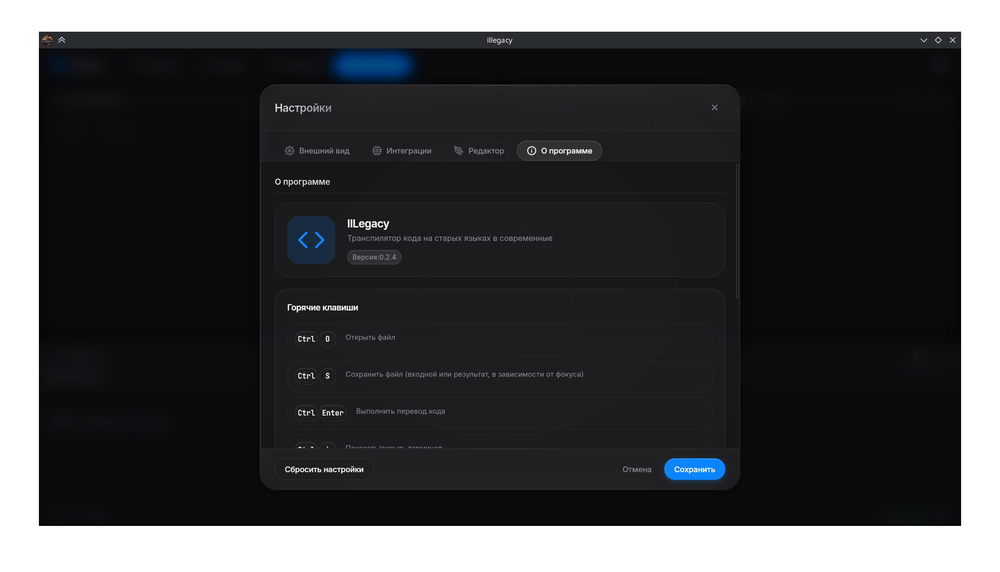

# illegacy

[License](LICENSE)
[Tauri](https://tauri.app)


**illegacy** — это инструмент для автоматизированной транспиляции устаревшего кода с языков программирования низкого и среднего уровня в современные высокоуровневые языки. Проект помогает модернизировать легаси-код, сохраняя его логику и структуру, но переводя в более актуальные и поддерживаемые языки.

## Текущий статус

На данный момент реализована схема:
- **Входной язык:** C
- **Выходной язык:** Python

### В разработке:
**Входные языки:**
- Fortran
- PHP
- COBOL

**Выходные языки:**
- Java
- Go

## Внешний вид
### Главная страница приложения


### Светлая тема


### Модальное окно настроек


## Возможности

Программа строит абстрактное синтаксическое дерево (AST) по исходному коду на C и на его основе генерирует эквивалентный код на Python. На данный момент поддерживаются следующие конструкции языка C:

### Типы данных
- Базовые типы (`int`, `float`, `double`, `char`)
- Указатели (с поддержкой многоуровневых указателей)
- Массивы (одномерные и многомерные)
- Структуры (`struct`) с вложенными структурами
- Объединения (`union`) с поддержкой вложенных структур
- Перечисления (`enum`) с явными и автоматическими значениями
- Типы, определенные через `typedef`

### Управляющие конструкции
- Условные операторы: `if`, `if-else`, `if-else if-else` (с поддержкой `elif`)
- Циклы: `while`, `do-while`, `for`
- Оператор выбора: `switch` (транслируется в `match` Python 3.10+)
- Операторы перехода: `break`, `continue`, `return`

### Операторы
- Арифметические: `+`, `-`, `*`, `/`, `%`
- Сравнения: `==`, `!=`, `<`, `>`, `<=`, `>=`
- Логические: `&&`, `||`, `!` (транслируются в `and`, `or`, `not`)
- Побитовые: `&`, `|`, `^`, `<<`, `>>` (с поддержкой в Python)
- Инкремент/декремент: префиксный и постфиксный (`++`, `--`)
- Тернарный оператор: `? :`
- Присваивания: простые и составные (`=`, `+=`, `-=`, и т.д.)

### Работа с памятью и указателями
- Создание указателей (`int *ptr`)
- Разыменование (`*ptr`)
- Взятие адреса (`&var`)
- Арифметика указателей (`ptr + n`, `*(ptr + i)`)
- Указатели на функции
- Двойные и тройные указатели
- Указатели на структуры и доступ к полям (`ptr->field`)

### Функции
- Объявление и определение функций
- Параметры-указатели
- Возвращаемые значения
- Рекурсивные функции

### Стандартная библиотека C
Многие функции стандартной библиотеки C автоматически транслируются в эквиваленты Python:

| Библиотека | Функции C | Эквивалент в Python |
|------------|-----------|---------------------|
| `math.h` | `sin`, `cos`, `tan`, `sqrt`, `pow`, `fabs` и др. | `math.sin()`, `math.cos()` и т.д. |
| `string.h` | `strlen`, `strcpy`, `strcat`, `strcmp` | методы строк Python |
| `stdio.h` | `printf`, `puts`, `scanf`, `fopen`, `fclose` | `print()`, `input()`, `open()` |
| `stdlib.h` | `malloc`, `calloc`, `free`, `atoi`, `rand` | списки Python, `int()`, `random` |
| `ctype.h` | `isalpha`, `isdigit`, `tolower`, `toupper` | методы строк Python |
| `time.h` | `time`, `clock`, `sleep` | `time.time()`, `time.sleep()` |

### Особые случаи
- Инициализация массивов строковыми литералами
- Именованные инициализаторы (designated initializers) для структур
- Вложенные структуры и объединения
- Анонимные структуры и объединения
- Перечисления с явно заданными значениями

## Установка

### Системные требования

- **Rust** 1.70+ (с Cargo)
- **Системные зависимости Tauri** (в зависимости от ОС)

#### Установка системных зависимостей

**Linux (Ubuntu/Debian):**
```bash
sudo apt update
sudo apt install libwebkit2gtk-4.0-dev build-essential curl wget file libssl-dev libgtk-3-dev libayatana-appindicator3-dev librsvg2-dev
```

**macOS:**
```bash
xcode-select --install
# Остальные зависимости устанавливаются автоматически через brew при необходимости
```

**Windows:**
- Установите [Visual Studio Build Tools](https://visualstudio.microsoft.com/downloads/#build-tools-for-visual-studio-2022) с компонентами "C++ build tools" и "Windows 10 SDK"
- Установите [WebView2](https://developer.microsoft.com/ru-ru/microsoft-edge/webview2/) (обычно предустановлен в Windows 11)

### Клонирование и сборка

```bash
# Клонировать репозиторий
git clone git@gitverse.ru:Fishman/illegacy.git
cd illegacy

# Запуск проекта через cargo
cargo tauri dev
```

### Структура проекта

```
illegacy/
├── src/                        # Frontend (HTML + CSS + JS)
│   ├── index.html
│   ├── css/
│   └── js/
├── src-tauri/                  # Backend на Rust
│   ├── src/
│   │   ├── main.rs             # Точка входа Tauri
│   │   ├── lib.rs
│   │   ├── ast/                # Определения AST
│   │   ├── parsers/            # Парсеры языков
│   │   └── generators/         # Генераторы кода
│   ├── docker/                 # Контейнеры с микросервисами
│   │   ├── c-parser/           # Парсер C
│   │   ├── f2c-service/        # Сервис трансляции C → Python
│   │   ├── build.sh
│   │   └── run.sh
│   ├── capabilities/           # Tauri capabilities
│   ├── gen/                    # Сгенерированные файлы
│   ├── icons/                  # Иконки приложения
│   ├── tests/                  # Тесты
│   ├── Cargo.toml              # Rust зависимости
│   ├── Cargo.lock
│   ├── build.rs
│   └── tauri.conf.json         # Конфигурация Tauri
├── .vscode/                    # Настройки VS Code
├── app-icon.png                # Иконка приложения
├── mainpage.png                # Скриншот интерфейса
├── LICENSE                     # Лицензия GPLv3
├── .gitignore
└── README.md
```

## Использование

1. Запустите приложение
2. Загрузите файл с исходным кодом на C
3. Нажмите кнопку перевода
4. Получите готовый код на Python
5. Сохраните файл на устройстве

## Разработка

### Добавление нового входного языка

1. Создайте новый микросервис в `docker/new_parser/`
2. Создайте новый парсер в `src-tauri/parsers/new_parser.c`
2. Реализуйте преобразование AST в набор узлов трейта AST
3. Интегрируйте парсер в основной модуль
4. Добавьте вызов Rust функций из фронтенда

### Добавление нового выходного языка

1. Создайте новый генератор (например, `java_gen.rs`)
2. Реализуйте трейт `Generator` для нового языка
3. Добавьте поддержку в интерфейс

## Лицензия

Проект распространяется под лицензией GPLv3. Подробнее см. в файле [LICENSE](LICENSE).

## Вклад в проект

Мы приветствуем вклад в развитие проекта! Если вы хотите помочь:

1. Форкните репозиторий
2. Создайте ветку для вашей функции (`git checkout -b feature/amazing-feature`)
3. Закоммитьте изменения (`git commit -m 'Add some amazing feature'`)
4. Запушьте ветку (`git push origin feature/amazing-feature`)
5. Откройте Pull Request